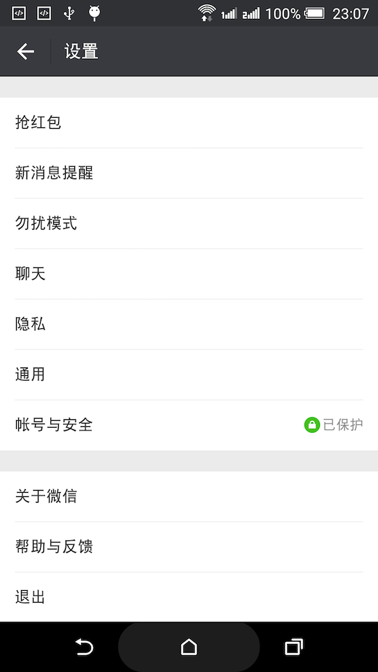

# 微信红包

> 微信红包，反编译微信客户端，进行代码插桩，造福无root或无xposed用户

## 免责声明

抱着学习态度，参照了网上一些xposed实现微信抢红包方案，使用apktool对`微信v6.5.6`客户端进行了反编译，并进行代码插桩，插桩代码为`insert`模块，另外开发了个设置模块`setting`，至于怎样使用`apktool`工具和`smali`代码插桩，另行学习。本项目仅供学习，用户使用后出现任何损失，概不负责。

## 效果图

## 存在的问题

由于反编译必然导致破坏安装包原有签名，其他应用通过微信进行登录或者分享都会做双向校验签名，这样会导致微信登录及分享提示未安装微信客户端。也有部分应用不做校验，例如全民k歌，简书等。

## 使用说明

下载项目根目录的`微信v6.5.6.apk`及`抢红包设置.apk`进行安装即可。安装完毕后到选项：`我-设置-抢红包` 开启红包设置。

私人红包不抢

## 代码插桩说明

### 一般插桩方式：

1. 使用`dex2jar`和`jd-gui`对被反编译应用进行静态分析，看看需要在哪里插入代码能实现自己想要的功能
2. 使用`android studio`进行插桩代码编写，编写插桩代码时，一般都会使用被反编译应用的一些类，可以伪造这些类，按需伪造，加上`@Deprecated`注解，代表插桩时无需关注。
3. 生成插桩代码应用，并进行反编译，使用`sublime-text`进行`smali`代码合并

有空再分享更多反编译知识
